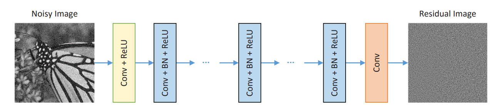
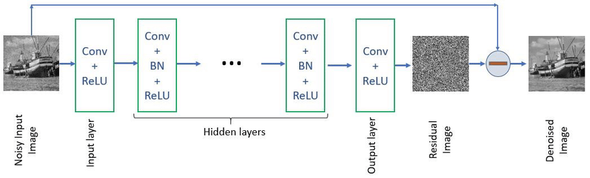
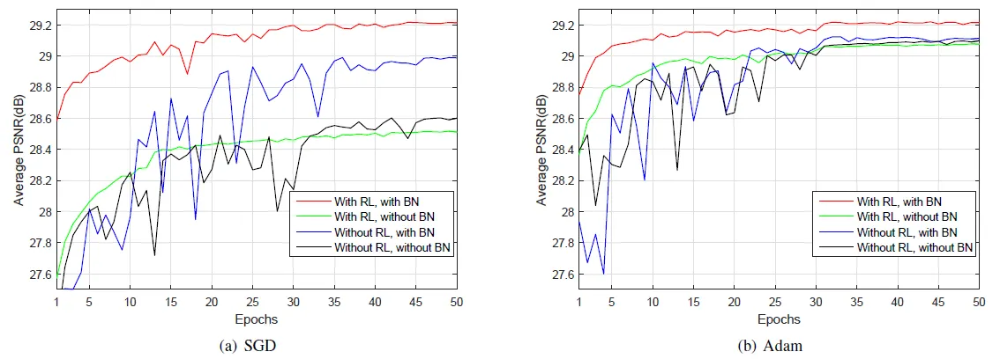
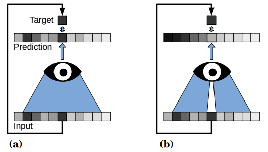
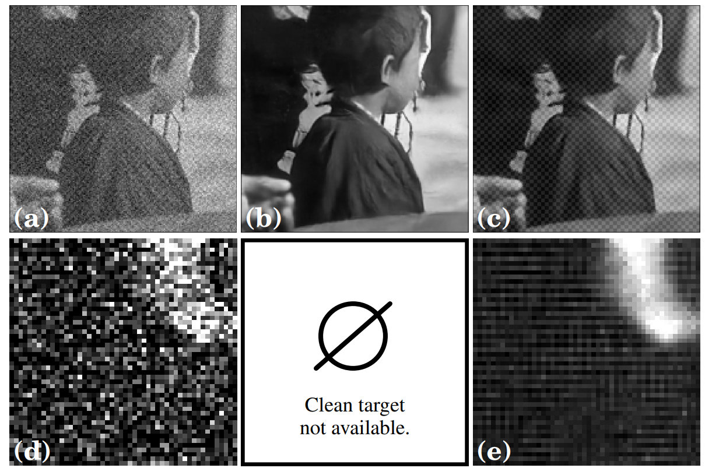
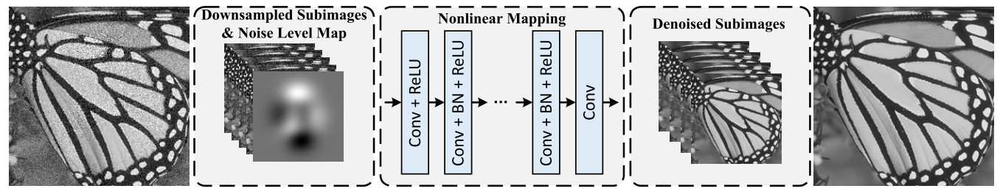
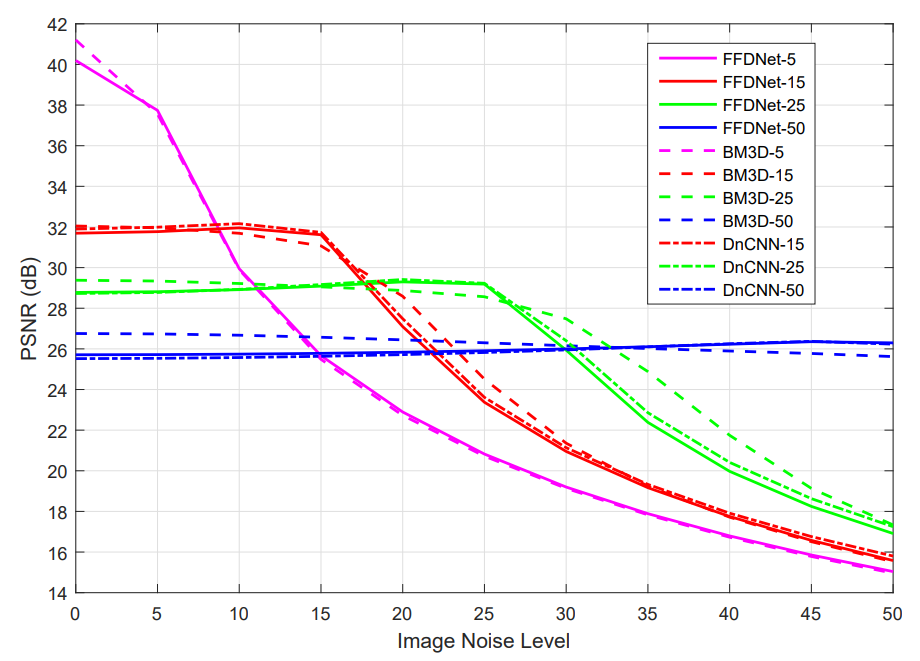

# PROJECT 3 CLASSES

I choosed image denoiser as final project topic.

## THEORY

- **Residual network** - Has skip connections, learns the difference between the input and output ("what has to be added/subtract in order to get a proper result). It helps with gradient vanishing and it makes learning faster
1.  **DnCNN**:
  - 
  - 
  - Convolutional filters - 3x3
  - Receptive field - (2d+1)(2d+1), where
    -  d - depth
    -  More receptive field the more context - network see more fragment of the image
  - Residual learning => x = y -R(y), 
    - R(y) - learnt 
  - 3 types of layers
    - First:
      - Conv+ReLU
    - Layers 2 to (d-1):
      -  Size 3x3x64 - (64 filters)
      -  BatchNorm - It keeps the inputs to each layer in a stable range - faster and more stable learning
      -  ReLU - activation function
   - Last layer:
      - Conv layer - reconstructs the output image
  - Zero padding - to keep the same image size
  - 

2. **Noise2Void**
   - 
   - Receptive field has one pixel blanked out (masked) - the model is being predicted based on the surrounding pixels only (without this center pixel)
   - Advantage of the blind-spot architecture is it's inability to learn the identity (input = output)
   - Predicting every pixel is very slow and inefficient, so we use a trick:
     - Extract 64x64 patches from the image (bigger than receptive field) - it's an input
     - Chose N pixels from this patch (stratified sampling) - those pixels will be masked (blind-spot)
     - Calculate loss only on those N pixels
     - Original noise pixels are targets, and loss is only calculated on masked pixels
   - Problems:
     - If noise is not pixel-independent (e.g. structured noise), the model can learn to use surrounding pixels to predict the noise component of the center pixel:
       

3. **FFDNet** 
  
   - Image of WxHxC is reshaped to W/2 x H/2 x 4C (4 sub-images)
   - Noise level map is concatenated with the input image
   - Orthogonal initialization method to the convolution filters (weight matrix is orthogonal) w^Tw = I (identity matrix). More stable training, reducing vanishing/exploding gradients.
   - Downsampled sub-images are concatenated with noise level map into the tensor of size W/2 x H/2 x (4C+1)
   - pipeline:
     - First: Conv + ReLU
     - Middle: Conv+BN+ReLU
     - Last: Conv
   - After last convolutional layer, an upscaling operation is applied to produce the estimated clean image of size W x H x C
   - Different from DnCNN, FFDNet doe not predict the noise
   - We need to preserve the trade-off between noise reduction and detail preservation.
   

## Papers notes:

1. [Beyond a Gaussian Denoiser: Residual Learning of Deep CNN for Image Denoising](https://arxiv.org/abs/1608.03981)
   - It gives a great results in image denoising task
   - It can be used both for known gaussian noise levels and unknown noise levels
   - It's better than BM3D in PSNR and SSIM metrics (most of the time). Generates more details and sharper edges than CBM3D
   - BM3D is a little bit faster, but comparing PSNR and SSIM results, it's worth waiting a bit longer
   - It's good for Gaussian Denoising, Single Image Super-Resolution and JPEG Image Deblocking
   - It can be used even though input image is noised by different types of noises
2. [Noise2Void - Learning Denoising From Single Noisy Images](https://openaccess.thecvf.com/content_CVPR_2019/html/Krull_Noise2Void_-_Learning_Denoising_From_Single_Noisy_Images_CVPR_2019_paper.html)
   - "N2V allows us to train directly on the body of data to be denoised and can therefore be applied when other methods cannot"
   - No need for clean target images
   - Assumptions: 
     - Signal pixels are dependent on their surroundings, noise pixels are not,
     - Noise mean is zero - "if we were to acquire multiple images with
        the same signal, but different realizations of noise and average them, the result would approach the true signal."
   - Receptive field - area of the input image that affects a particular output pixel
3. [SUNet: Swin Transformer UNet for Image Denoising](https://arxiv.org/abs/2202.14009)
4. [A Residual Dense U-Net Neural Network for Image Denoising](https://ieeexplore.ieee.org/document/9360532)
   - RDUNet consist of densley connected convolutional layers to reuse the feature maps and local residual learning to avoid the vanishing gradient problem
   - The model predicts the residual noise of the corrupted image instead of denoised image directly
   - Assumption:
     - Noise is additive y = x + n, where y - noised image, x - clean image, n
   - U-Net architecture:
     - contracting path (encoder) - capture context,
     - expanding path (decoder) - estimate the segmentation
   - Residual Dense Block (RDB):
     - Based on DHDN (Densely connected hierarchical) 
     - Densely connected conv layers - each layer has connections to all subsequent layers
     - Local feature fusion - 1x1 conv layer to adaptively learn the weights for each feature map
     - Local residual learning - skip connection from input to output of RDB 
5. [FFDNet: Toward a Fast and Flexible Solution for CNN based Image Denoisin](https://arxiv.org/abs/1710.04026)
   - Additional, tunable noise level map as the input.
   - Works on downsampled sub-images
   - Has ability to handle a wide range of noise levels 
   - Can remove spatially variant noise
   - TERM: Spatially variant noise - noise level is different in different parts of the image
   - TERM: AWGN - additive withe Gaussian noise
   - For DnCNN model parameters vary with the change of noise level, while in the FFDNet model, the noise level map is modeled as an input and the model parameters are independent of the noise level.
