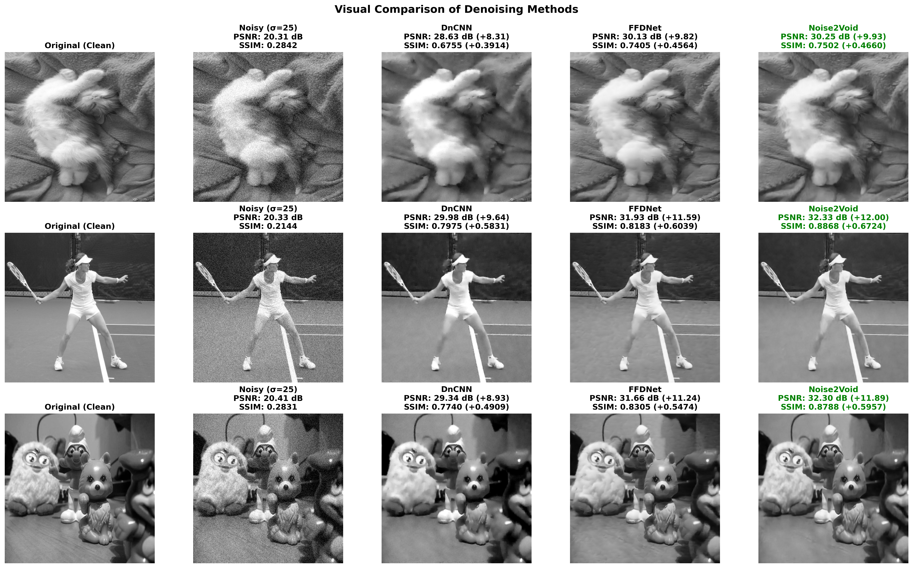
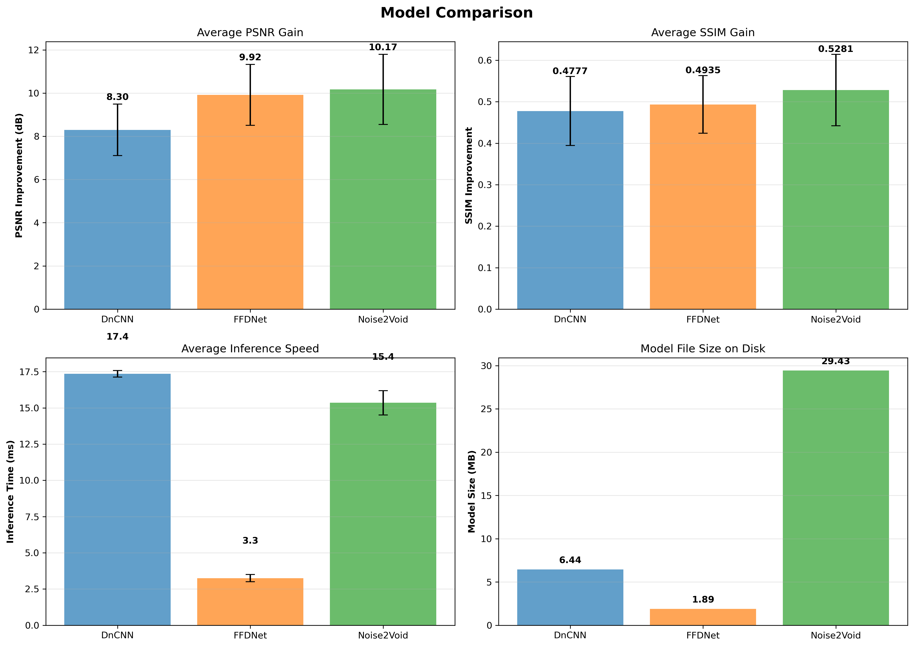
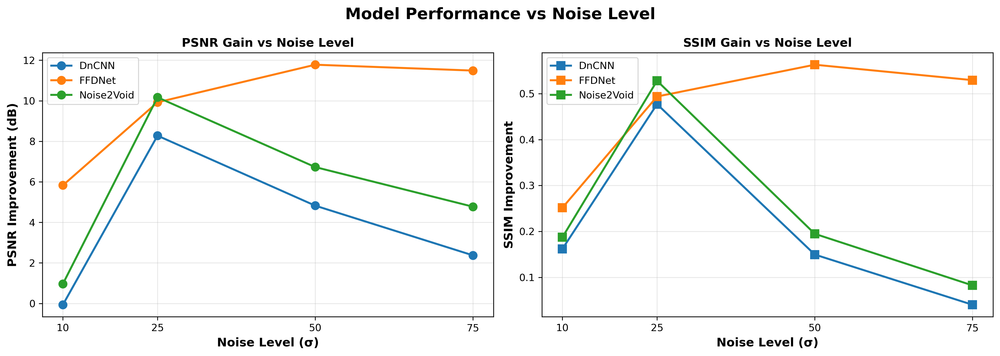
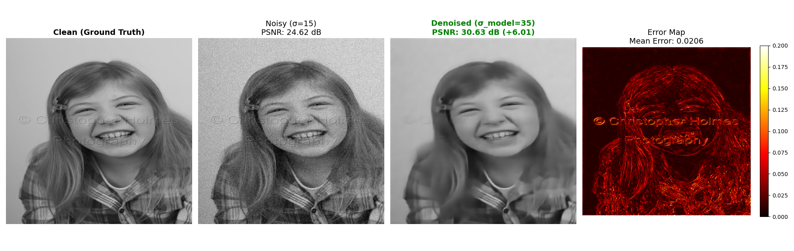
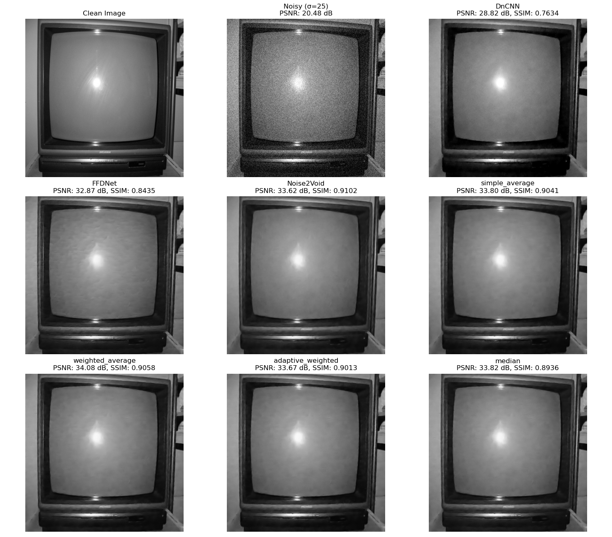
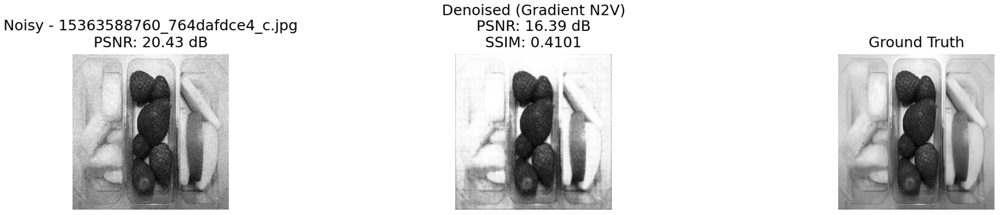
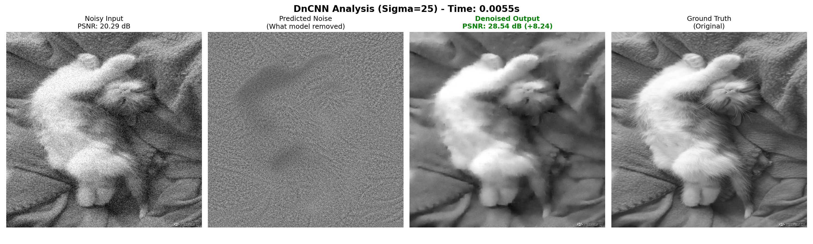
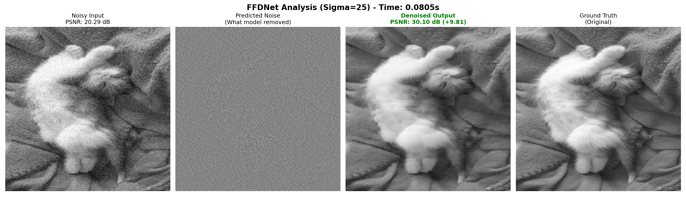

# AI image denoiser

This repository contains implementations of:
- DnCNN (Denoising Convolutional Neural Network)
- FFDNet (Fast and Flexible Denoising Convolutional Neural Network)
- Noise2Void (Self-supervised denoising using U-Net architecture)

Moreover, here are some scripts for training, testing, and generating results for these models.

It was created based on the review of scientific works about image denoising using deep learning methods. You can find the review [here](review_of_scientific_works.md).

This project is part of the Computational Intelligence course at AGH University of Science and Technology.

## How to run it

First of all, run `main.py` to download datasets, and process images. Then all the other scripts should work as is.

List of scripts:
- `DNCNN/dnCNN.py` - Implementation of DnCNN model with training and testing scripts.
- `FFDnet/ffdnet.py` - Implementation of FFDNet model with training and testing scripts.
- `FFDNet/test_ffdnet.py` - Script to test FFDNet model on one noisy image.
- `FFDnet/test_controlled_noise.py` - Script to test FFDNet with different noise leves on both dataset and noise map.
- `Noise2Void/noise2void.py` - Implementation of Noise2Void model with training and testing scripts.
- `Noise2Void/test_n2v.py` - Script to test Noise2Void model on one noisy image.
- `compare_all_models.py` - Script to compare all three models on the same test dataset and generate results.
- `generate_presentation_results.py` - Script to generate results that compares DnCNN with FFDNet
- `ensamble_models.py` - Script to combine outputs of all three models using different strategies (mean, weighted mean, median).

## Pre-trained models

You can find pre-trained models in the `models/` directory. These models were trained on grayscale images with Gaussian noise (σ = 25).

## Results

### Visual comparison of denoising results between DnCNN, FFDNet, and Noise2Void

### Expectations vs Reality

Judging by the research papres:
- DnCNN is the simplest model, that gives the worst restults among the three.
- FFDNet is faster, better, more flexible than DnCNN, and gives better results.
- Noise2Void is a self-supervised method, that does not require clean images for training, and gives comparable results to supervised methods.

However, in practice the results were very much the same, with one little suprise - Noise2Void outperformed both DnCNN and FFDNet in terms of PSNR and visual quality, despite being a self-supervised method (probably due to usage of U-Net architecture).

As you can see here, Noise2Void achieved the highest PSNR and SSIM gain, followed by FFDNet and DnCNN. The DnCNN was the slowest model, while FFDNet was the fastest. Noise2Void was in between in terms of speed. Noise2Void's model size was the largest. 

Speaking of flexibility, FFDNet allows to adjust the noise level during inference, and was trained with dynamic noise levels, which makes it more versatile.

FFDnet outperformed both DnCNN and Noise2Void when tested on different noise levels, which confirms its robustness to varying noise conditions.

### Watermark removal using FFDNet

By accident, I discovered that, when we noise the image with a watermark to some higher noise level (σ = 25), and then denoise it with FFDNet (adding higher level of noise in noise map, e.g σ = 50), then this watermark disappears from the image, while the rest of the image remains relatively clear. It's drawback is that the image becomes a bit blurrier, but the watermark is gone.

### Model Combination
I've also tried combining models using different strategies, such as:
- Averaging outputs of models using mean or median
- Averaging outputs of models using weighted average
- Averating outputs of models using median

And well, Images gained something around 0.5 - 1 p.p. in PSNR, but this method requires running all three models,
    which makes it impractical in real-world applications.

### Attempt of controlling the noise level while masking (for Noise2Void)

While picking masked pixels randomly is a good approach, I wanted to see if controlling the noise level of masked pixels would improve the results. I decided to mask pixels with higher gradient magnitude more often, as they are more likely to contain important structures (such as shapes, borders). I thought that by focusing on these pixels, the model would learn to denoise more effectively (by preserving more details and keeping the denoised image sharper). But...

It resolulted in generating images with lower PSNR than the noised images. This approach focued more on black areas, removing details from the image instead of denoising it properly. Not sure what went wrong here, but I will try to investigate it further in the future.

### Other results
**DnCNN Analysis**

**FFDNet Analysis**

